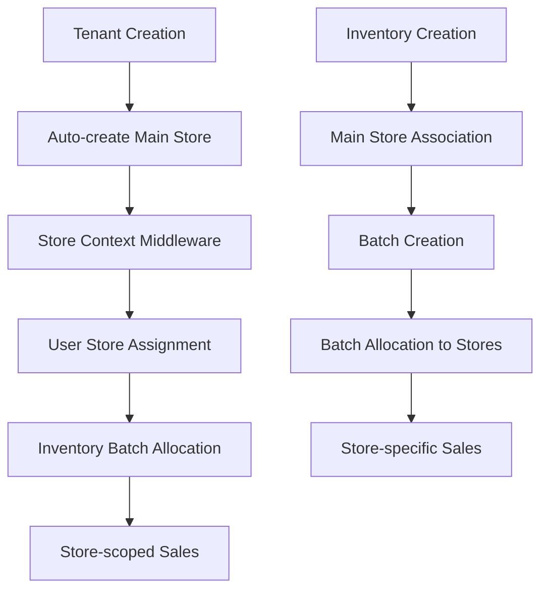

# Store Management System Design

## Overview

The store management system extends the existing tenant-based architecture by introducing a hierarchical store structure within each tenant. This design maintains backward compatibility while adding store-scoped operations, inventory batch allocations, and user assignments. The system follows the same patterns established by the tenant context middleware and integrates seamlessly with the existing role-based permission system.

## Architecture

### Core Concepts

1. **Store Hierarchy**: Each tenant has one main store (created automatically) and optional sub-stores
2. **Inventory Ownership**: All inventory items belong to the main store, but batches can be allocated to any store
3. **User Assignment**: Users are assigned to specific stores (except super admins/tenant owners)
4. **Store Context**: Similar to tenant context, provides store-scoped operations
5. **Permission Integration**: Store permissions integrate with existing RBAC system

### Data Flow



## Components and Interfaces

### 1. Store Model (Prisma Schema)

```prisma
model Store {
  id          String   @id @default(auto()) @map("_id") @db.ObjectId
  name        String
  description String?
  address     String?
  phone       String?
  email       String?
  isMain      Boolean  @default(false)
  isActive    Boolean  @default(true)
  
  // Tenant relationship
  tenantId    String   @db.ObjectId
  tenant      Tenant   @relation(fields: [tenantId], references: [id], onDelete: Cascade)
  
  // Direct user assignments (following existing pattern)
  assignedUsers User[] @relation("UserStore")
  
  // Inventory batch allocations
  batchAllocations InventoryBatchAllocation[]
  
  // Sales
  sales       Sales[]
  
  createdAt   DateTime @default(now())
  updatedAt   DateTime @updatedAt
  deletedAt   DateTime?
  
  @@unique([tenantId, name])
  @@map("stores")
}

// Enhanced User model (additions to existing model)
model User {
  // ... existing fields ...
  
  // Store assignment (direct relationship)
  assignedStoreId String? @db.ObjectId
  assignedStore   Store?  @relation("UserStore", fields: [assignedStoreId], references: [id])
  
  // ... rest of existing fields and relationships ...
}

model InventoryBatchAllocation {
  id              String @id @default(auto()) @map("_id") @db.ObjectId
  
  batchId         String @db.ObjectId
  batch           InventoryBatch @relation(fields: [batchId], references: [id], onDelete: Cascade)
  
  storeId         String @db.ObjectId
  store           Store @relation(fields: [storeId], references: [id], onDelete: Cascade)
  
  allocatedQuantity Int
  remainingQuantity Int
  
  createdAt       DateTime @default(now())
  updatedAt       DateTime @updatedAt
  
  @@unique([batchId, storeId])
  @@map("inventory_batch_allocations")
}
```

### 2. Store Service Interface

```typescript
interface IStoreService {
  // Store CRUD operations
  createStore(tenantId: string, createStoreDto: CreateStoreDto): Promise<Store>
  findAllByTenant(tenantId: string): Promise<Store[]>
  findOne(id: string, tenantId: string): Promise<Store>
  update(id: string, tenantId: string, updateStoreDto: UpdateStoreDto): Promise<Store>
  remove(id: string, tenantId: string): Promise<void>
  
  // Main store operations
  findMainStore(tenantId: string): Promise<Store>
  createMainStore(tenantId: string, tenantData: any): Promise<Store>
  
  // User assignment operations
  assignUserToStore(userId: string, storeId: string): Promise<User>
  getUserStore(userId: string): Promise<Store | null>
  getStoreUsers(storeId: string): Promise<User[]>
  
  // Batch allocation operations
  allocateBatchToStore(batchId: string, storeId: string, quantity: number): Promise<InventoryBatchAllocation>
  getStoreBatchAllocations(storeId: string): Promise<InventoryBatchAllocation[]>
  transferBatchAllocation(fromStoreId: string, toStoreId: string, batchId: string, quantity: number): Promise<void>
}
```

### 3. Store Context Integration

#### JWT Token Enhancement
Following the existing tenant pattern, store information will be added to the JWT payload:

```typescript
// Enhanced JWT payload structure
interface JWTPayload {
  sub: string;        // user ID
  tenant: string;     // encrypted tenant ID (existing)
  store?: string;     // encrypted store ID (new)
}
```

#### Store Context Service
```typescript
@Injectable({ scope: Scope.REQUEST })
export class StoreContext {
  constructor(@Inject(REQUEST) private readonly request: Request) {}

  getStoreId(): string | null {
    return this.request.storeId || null;
  }

  requireStoreId(): string {
    const storeId = this.request.storeId ?? this.request.headers['storeid'] as string | undefined;
    if (!storeId) {
      throw new UnauthorizedException('Store ID not found in request context');
    }
    return storeId;
  }
}
```

#### Store Middleware
```typescript
export function storeMiddleware(req: Request, res: Response, next: NextFunction) {
  try {
    const fullPath = req.originalUrl || req.url
    
    // Skip middleware for paths that don't require store context
    if (shouldSkipStoreCheck(fullPath)) {
      return next()
    }
    
    const token = req.headers.authorization?.split(" ")[1]
    if (!token) {
      return next() // Let tenant middleware handle auth errors
    }
    
    // Extract store ID from JWT token (similar to tenant extraction)
    const storeId = extractStoreIdFromToken(token)
    
    if (storeId) {
      req['storeId'] = storeId
      req.headers['storeid'] = storeId
    } else {
      // Fallback to user's default store if no store in token
      const userId = extractUserIdFromToken(token)
      if (userId) {
        const defaultStoreId = await getUserDefaultStore(userId)
        if (defaultStoreId) {
          req['storeId'] = defaultStoreId
          req.headers['storeid'] = defaultStoreId
        }
      }
    }
    
    next()
  } catch (error) {
    console.error("StoreMiddleware error:", error.message)
    next()
  }
}
```

#### Store Utilities
```typescript
// Store encryption/decryption (following tenant pattern)
export function encryptStoreId(storeId: string): string {
  const iv = crypto.randomBytes(IV_LENGTH);
  const cipher = crypto.createCipheriv('aes-256-cbc', keyBuffer, iv);
  let encrypted = cipher.update(storeId);
  encrypted = Buffer.concat([encrypted, cipher.final()]);
  return iv.toString('hex') + ':' + encrypted.toString('hex');
}

export function decryptStoreId(text: string): string {
  try {
    const [iv, encrypted] = text.split(':');
    const ivBuffer = Buffer.from(iv, 'hex');
    const encryptedText = Buffer.from(encrypted, 'hex');
    const decipher = crypto.createDecipheriv('aes-256-cbc', keyBuffer, ivBuffer);
    let decrypted = decipher.update(encryptedText);
    decrypted = Buffer.concat([decrypted, decipher.final()]);
    return decrypted.toString();
  } catch (err) {
    console.error('Store decryption error:', err.message);
    return null;
  }
}

export function extractStoreIdFromToken(token: string): string | null {
  try {
    if (!token) return null
    
    const payload = jwt.verify(token, JWT_SECRET)
    
    if (!payload || typeof payload !== "object" || !payload.store) {
      return null
    }
    
    return decryptStoreId(payload.store)
  } catch (error) {
    console.error("Store JWT extraction error:", error.message)
    return null
  }
}

export function shouldSkipStoreCheck(path: string): boolean {
  const excludedPaths = [
    "/api/v1/auth/login",
    "/api/v1/auth/register", 
    "/api/v1/auth/forgot-password",
    "/api/v1/auth/reset-password",
    "/api/v1/admin",
    "/api/v1/auth/create-superuser",
    "/api/v1/tenants",
    "/api/v1/auth/select-tenant",
    "/api/v1/auth/select-store", // New endpoint for store selection
    "/health",
    "/docs",
  ]
  
  return excludedPaths.some((excluded) => path.startsWith(excluded))
}
```

#### Enhanced Authentication Service
```typescript
// Updated login method in AuthService
async login(data: LoginUserDTO, res: Response) {
  // ... existing login logic ...
  
  // After tenant selection, also handle store selection
  if (tenantId) {
    const tenantMatch = userTenants.find((ut) => ut.tenantId === tenantId);
    if (!tenantMatch) {
      throw new ForbiddenException("You do not have access to this tenant.");
    }
    
    // Get user's assigned store for this tenant
    const userStore = await this.getUserStore(user.id, tenantId);
    
    const encryptedTenant = encryptTenantId(tenantId);
    let payload: any = { sub: user.id, tenant: encryptedTenant };
    
    // If user has an assigned store, include it in token
    if (userStore) {
      const encryptedStore = encryptStoreId(userStore.id);
      payload.store = encryptedStore;
    }
    
    const access_token = this.jwtService.sign(payload);
    
    // ... rest of login logic ...
    
    return {
      user: plainToInstance(UserEntity, filteredUser),
      access_token,
      hasMultipleTenants: false,
      assignedStore: userStore
    };
  }
}

// New method for store selection
async selectStoreLogin(userId: string, storeId: string, res: Response) {
  const user = await this.prisma.user.findUnique({
    where: { id: userId },
    include: {
      tenants: {
        include: {
          tenant: true,
          role: { include: { permissions: true } },
        },
      },
    },
  });

  if (!user) {
    throw new ForbiddenException('User not found.');
  }

  // Verify user has access to this store
  const store = await this.prisma.store.findFirst({
    where: { 
      id: storeId,
      OR: [
        { assignedUsers: { some: { id: userId } } }, // User is assigned to this store
        { tenant: { users: { some: { userId, role: { role: 'admin' } } } } } // User is admin
      ]
    }
  });

  if (!store) {
    throw new ForbiddenException('You do not have access to this store.');
  }

  // Get existing token to extract tenant info
  const existingToken = req.headers.authorization?.split(" ")[1];
  const tenantId = extractTenantIdFromToken(existingToken);

  const encryptedTenant = encryptTenantId(tenantId);
  const encryptedStore = encryptStoreId(storeId);
  const payload = { sub: user.id, tenant: encryptedTenant, store: encryptedStore };
  const access_token = this.jwtService.sign(payload);

  res.setHeader('access_token', access_token);
  res.setHeader('Access-Control-Expose-Headers', 'access_token');

  return {
    user: plainToInstance(UserEntity, user),
    access_token,
    selectedStore: store,
  };
}
```

### 4. Store Controller

```typescript
@Controller('stores')
@UseGuards(JwtAuthGuard, TenantGuard)
export class StoreController {
  constructor(private readonly storeService: StoreService) {}
  
  @Post()
  @RequirePermissions(Action.Write, Subject.Store)
  create(@Body() createStoreDto: CreateStoreDto, @TenantId() tenantId: string) {
    return this.storeService.createStore(tenantId, createStoreDto)
  }
  
  @Get()
  @RequirePermissions(Action.Read, Subject.Store)
  findAll(@TenantId() tenantId: string, @StoreId() storeId?: string) {
    // Super admins see all stores, regular users see their assigned stores
    return this.storeService.findAllByTenant(tenantId, storeId)
  }
  
  @Get(':id')
  @RequirePermissions(Action.Read, Subject.Store)
  findOne(@Param('id') id: string, @TenantId() tenantId: string) {
    return this.storeService.findOne(id, tenantId)
  }
  
  @Patch(':id')
  @RequirePermissions(Action.Write, Subject.Store)
  update(@Param('id') id: string, @Body() updateStoreDto: UpdateStoreDto, @TenantId() tenantId: string) {
    return this.storeService.update(id, tenantId, updateStoreDto)
  }
  
  @Delete(':id')
  @RequirePermissions(Action.Delete, Subject.Store)
  remove(@Param('id') id: string, @TenantId() tenantId: string) {
    return this.storeService.remove(id, tenantId)
  }
  
  // Batch allocation endpoints
  @Post(':id/allocate-batch')
  @RequirePermissions(Action.Write, Subject.Store)
  allocateBatch(
    @Param('id') storeId: string,
    @Body() allocateBatchDto: AllocateBatchDto,
    @TenantId() tenantId: string
  ) {
    return this.storeService.allocateBatchToStore(allocateBatchDto.batchId, storeId, allocateBatchDto.quantity)
  }
  
  // User assignment endpoints
  @Post(':id/assign-user')
  @RequirePermissions(Action.Write, Subject.Store)
  assignUser(
    @Param('id') storeId: string,
    @Body() assignUserDto: AssignUserDto,
    @TenantId() tenantId: string
  ) {
    return this.storeService.assignUserToStore(assignUserDto.userId, storeId)
  }
  
  @Get(':id/users')
  @RequirePermissions(Action.Read, Subject.Store)
  getStoreUsers(@Param('id') storeId: string, @TenantId() tenantId: string) {
    return this.storeService.getStoreUsers(storeId)
  }
}

// Store Decorators
export const StoreId = createParamDecorator(
  (data: unknown, ctx: ExecutionContext) => {
    const request = ctx.switchToHttp().getRequest();
    return request.storeId;
  },
);
```

### 5. Enhanced Authentication Controller

```typescript
@Controller('auth')
export class AuthController {
  constructor(private readonly authService: AuthService) {}
  
  // ... existing auth endpoints ...
  
  @Post('select-store')
  @UseGuards(JwtAuthGuard)
  async selectStore(
    @Body() selectStoreDto: SelectStoreDto,
    @Res({ passthrough: true }) res: Response,
    @GetUser('id') userId: string,
  ) {
    return this.authService.selectStoreLogin(userId, selectStoreDto.storeId, res);
  }
  
  @Get('user-store')
  @UseGuards(JwtAuthGuard, TenantGuard)
  async getUserStore(
    @GetUser('id') userId: string,
    @TenantId() tenantId: string,
  ) {
    return this.authService.getUserStore(userId, tenantId);
  }
}
```

## Data Models

### Store Entity
- **id**: Unique identifier
- **name**: Store name (unique within tenant)
- **description**: Optional store description
- **address, phone, email**: Contact information
- **isMain**: Boolean flag indicating main store
- **isActive**: Store status
- **tenantId**: Foreign key to tenant
- **Relationships**: tenant, userStores, batchAllocations, sales

### UserStore Junction Table
- Links users to stores within a tenant
- Supports many-to-many relationship (users can be assigned to multiple stores)
- Super admins and tenant owners bypass this restriction

### InventoryBatchAllocation
- Tracks how inventory batches are distributed across stores
- **allocatedQuantity**: Total quantity allocated to store
- **remainingQuantity**: Available quantity for sales
- Ensures inventory tracking accuracy

## Error Handling

### Store-Specific Errors
1. **StoreNotFound**: When accessing non-existent store
2. **InsufficientBatchQuantity**: When allocating more than available
3. **MainStoreRequired**: When trying to delete main store
4. **StoreAccessDenied**: When user lacks store permissions
5. **InvalidStoreContext**: When store context is invalid

### Error Response Format
```typescript
{
  statusCode: number,
  message: string,
  error: string,
  context?: {
    storeId?: string,
    tenantId?: string,
    userId?: string
  }
}
```

## Testing Strategy

### Unit Tests
1. **Store Service Tests**
   - CRUD operations
   - Main store creation
   - User assignment logic
   - Batch allocation logic

2. **Store Controller Tests**
   - Endpoint functionality
   - Permission validation
   - Error handling

3. **Store Middleware Tests**
   - Context extraction
   - Path skipping logic
   - Error scenarios

### Integration Tests
1. **Store Creation Flow**
   - Tenant creation triggers main store creation
   - Transaction rollback scenarios

2. **Batch Allocation Flow**
   - Allocate batches to stores
   - Sales from allocated batches
   - Quantity tracking accuracy

3. **Permission Integration**
   - Store-specific permissions
   - Role-based access control
   - Multi-store access for admins

### End-to-End Tests
1. **Complete Store Workflow**
   - Create tenant → main store created
   - Create sub-stores → user assignments
   - Allocate batches → process sales

2. **Multi-Store Scenarios**
   - Cross-store batch transfers
   - Store-scoped user operations
   - Admin access to all stores

## Security Considerations

### Access Control
1. **Store Context Validation**: Ensure users can only access assigned stores
2. **Batch Allocation Security**: Prevent over-allocation and unauthorized transfers
3. **Permission Inheritance**: Super admins inherit all store permissions

### Data Isolation
1. **Tenant Boundary**: Stores cannot cross tenant boundaries
2. **Store Scoping**: Operations are properly scoped to user's store context
3. **Audit Trail**: Track all store-related operations for compliance

## Performance Considerations

### Database Optimization
1. **Indexing Strategy**
   - Composite indexes on (tenantId, storeId)
   - Index on user store assignments
   - Index on batch allocations

2. **Query Optimization**
   - Efficient store lookup queries
   - Batch allocation aggregations
   - User permission checks

### Caching Strategy
1. **Store Context Caching**: Cache user's default store
2. **Permission Caching**: Cache store-specific permissions
3. **Batch Allocation Caching**: Cache frequently accessed allocations

## Migration Strategy

### Database Migration
1. **Create Store Tables**: Add Store, UserStore, InventoryBatchAllocation models
2. **Update Existing Tables**: Add store references where needed
3. **Data Migration**: Create main stores for existing tenants
4. **Update Permissions**: Add Store subject to existing permission system

### Code Migration
1. **Backward Compatibility**: Existing APIs continue to work
2. **Gradual Adoption**: New store features are opt-in
3. **Middleware Integration**: Store middleware works alongside tenant middleware

### Deployment Strategy
1. **Feature Flags**: Control store feature rollout
2. **Monitoring**: Track store-related operations and performance
3. **Rollback Plan**: Ability to disable store features if issues arise

### Integration with Existing Systems

#### Tenant Service Enhancement
```typescript
// Update TenantService.createTenant method
async createTenant(createTenantDto: CreateTenantDto) {
  return this.prisma.$transaction(async (tx) => {
    // Create tenant
    const tenant = await tx.tenant.create({
      data: {
        // ... existing tenant data
      }
    });
    
    // Auto-create main store
    const mainStore = await tx.store.create({
      data: {
        name: `${tenant.companyName} Main Store`,
        tenantId: tenant.id,
        isMain: true,
        phone: tenant.phone,
        email: tenant.email,
      }
    });
    
    return { tenant, mainStore };
  });
}
```

#### User Model Enhancement
The User model will be enhanced with a direct store assignment relationship:

```prisma
model User {
  // ... existing fields from user.prisma ...
  
  // New store assignment field
  assignedStoreId String? @db.ObjectId
  assignedStore   Store?  @relation("UserStore", fields: [assignedStoreId], references: [id])
  
  // ... rest of existing relationships ...
}
```

This approach follows the existing pattern in the User model where direct relationships are used (like `agentDetails Agent?`) rather than junction tables.

#### Permission System Integration
```prisma
// Update SubjectEnum in role.prisma
enum SubjectEnum {
  all
  User
  Sales
  Agents
  Customers
  Inventory
  Accounts
  Products
  Contracts
  Support
  Communication
  Store  // New store subject
}
```

### Migration Strategy

#### Database Migration Steps
1. **Phase 1: Create Store Tables**
   ```sql
   -- Create stores table
   -- Create inventory_batch_allocations table
   -- Update SubjectEnum to include Store
   -- Add assignedStoreId to User model
   ```

2. **Phase 2: Data Migration**
   ```typescript
   // Migration script to create main stores for existing tenants
   async function migrateExistingTenants() {
     const tenants = await prisma.tenant.findMany();
     
     for (const tenant of tenants) {
       await prisma.store.create({
         data: {
           name: `${tenant.companyName} Main Store`,
           tenantId: tenant.id,
           isMain: true,
           phone: tenant.phone,
           email: tenant.email,
         }
       });
     }
   }
   ```

3. **Phase 3: User Store Assignments**
   ```typescript
   // Assign all existing users to their tenant's main store
   async function assignUsersToMainStores() {
     const users = await prisma.user.findMany({
       include: { 
         tenants: { 
           include: { 
             tenant: { 
               include: { stores: { where: { isMain: true } } } 
             } 
           } 
         } 
       }
     });
     
     for (const user of users) {
       // For users with single tenant, assign to main store
       if (user.tenants.length === 1) {
         const mainStore = user.tenants[0].tenant.stores[0];
         if (mainStore) {
           await prisma.user.update({
             where: { id: user.id },
             data: { assignedStoreId: mainStore.id }
           });
         }
       }
     }
   }
   ```

#### Code Migration Strategy
1. **Backward Compatibility**: All existing APIs continue to work without modification
2. **Middleware Chain**: Store middleware runs after tenant middleware
3. **Gradual Feature Adoption**: New store features are additive, not breaking
4. **Default Behavior**: Users without explicit store assignments default to main store

#### Deployment Strategy
1. **Feature Flags**: Use environment variables to control store feature rollout
2. **Database Migration**: Run migrations during maintenance window
3. **Monitoring**: Track store-related operations and performance metrics
4. **Rollback Plan**: Ability to disable store middleware if issues arise
5. **Testing**: Comprehensive testing of multi-store scenarios before production

### Backward Compatibility Considerations

#### Existing Inventory Operations
- All existing inventory operations continue to work unchanged
- Inventory items remain tied to main store by default
- Batch allocations are automatically assigned to main store for existing data

#### Existing Sales Operations
- Current sales processes continue without modification
- Sales are automatically scoped to user's assigned store
- Existing sales data remains valid and accessible

#### User Experience
- Users without store assignments automatically get main store access
- Super admins and tenant owners bypass store restrictions
- Existing authentication flows work with optional store context